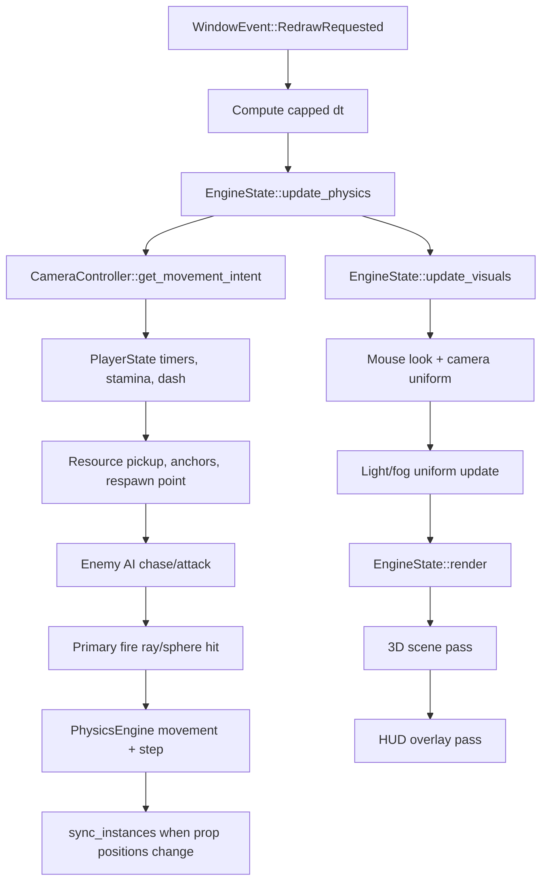
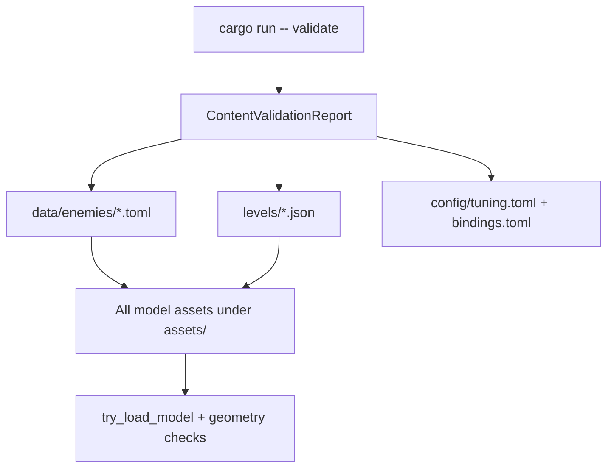

# Cenotaph Project Map

Use this as the friendly map of the repository. It answers three questions:

1. Where does the game start?
2. Which files own which parts of the game?
3. Where should new content or code go?

For deep design intent, read `README.md`, `FOUNDATION.md`, and `SYSTEMS.md`.
For a dense inventory, read `PROJECT_DOCUMENTATION.txt`.

## First Read

The runtime shape is:

```text
main.rs
  -> app.rs
    -> EngineState
      -> update.rs for gameplay and physics
      -> render modules for drawing
      -> data/config/levels/assets for authored content
```

The most important files are:

- `src/main.rs` starts the program or runs validation.
- `src/app.rs` owns the window event loop.
- `src/core/engine/state.rs` owns the runtime state and GPU setup.
- `src/core/engine/update.rs` owns per-frame gameplay.
- `src/data/world/level.rs` defines level JSON.
- `src/data/enemy.rs` defines enemy TOML.
- `src/data/config/gameplay.rs` defines tuning and bindings.
- `src/systems/physics/engine.rs` owns Rapier physics.
- `src/systems/render/*` owns rendering.

## Runtime Flow

```mermaid
flowchart TD
    main["src/main.rs"]
    app["src/app.rs"]
    state["src/core/engine/state.rs"]
    update["src/core/engine/update.rs"]
    sync["src/core/engine/sync.rs"]
    render["EngineState::render"]

    config["config/*.toml -> src/data/config/gameplay.rs"]
    levels["levels/*.json -> src/data/world/level.rs"]
    enemies["data/enemies/*.toml -> src/data/enemy.rs"]
    models["assets/*.obj/glb -> src/systems/render/mesh.rs"]
    textures["textures/* -> src/core/engine/loader.rs"]

    input["src/systems/input/manager.rs"]
    player["src/game/player.rs"]
    combat["src/game/combat.rs"]
    enemy_ai["src/game/enemy.rs"]
    progress["src/game/progression.rs"]
    physics["src/systems/physics/engine.rs"]
    audio["src/systems/audio/mod.rs"]

    camera["src/systems/render/camera.rs"]
    lighting["src/systems/render/lighting.rs"]
    assets["src/systems/render/assets.rs"]
    pipeline["src/systems/render/pipeline.rs"]
    shader["src/systems/render/shader.wgsl"]
    hud["src/systems/render/hud.rs + hud.wgsl"]

    main --> app --> state
    state --> config
    state --> levels
    state --> enemies
    state --> models
    state --> textures
    app --> input
    app --> update
    update --> player
    update --> combat
    update --> enemy_ai
    update --> progress
    update --> physics
    update --> audio
    update --> camera
    update --> lighting
    update --> sync
    sync --> assets
    state --> pipeline --> shader
    state --> render
    render --> assets
    render --> camera
    render --> lighting
    render --> hud
```



## Per-Frame Flow



## Content Validation Flow



Validation checks content without opening a game window. Use it after changing
levels, enemy/relic TOML, config TOML, or model assets.

## Folder Guide

```text
config/       Designer-facing tuning and keybindings.
data/         Structured gameplay definitions, currently enemies.
levels/       Playable level JSON plus level source/export files.
assets/       Runtime model assets and source art files.
textures/     Optional image textures; fallback texture is used when empty.
scripts/      Local project checks.
src/          Rust source code.
Dev/          Concept/reference art.
```

## Module Tree

```text
src/main.rs
  src/app.rs
  src/core/mod.rs
    src/core/engine/mod.rs
      asset_catalog.rs
      loader.rs
      state.rs
      sync.rs
      update.rs
      validation.rs
  src/data/mod.rs
    config/mod.rs
      gameplay.rs
    enemy.rs
    world/mod.rs
      level.rs
  src/game/mod.rs
    combat.rs
    enemy.rs
    player.rs
    progression.rs
  src/systems/mod.rs
    audio/mod.rs
    input/mod.rs
      manager.rs
    physics/mod.rs
      engine.rs
    render/mod.rs
      assets.rs
      camera.rs
      hud.rs
      hud.wgsl
      instance.rs
      lighting.rs
      mesh.rs
      pipeline.rs
      shader.wgsl
      texture.rs
```

## File-By-File Guide

### Project Root

- `.cargo/config.toml` - Cargo settings for this workspace.
- `.gitignore` - Keeps build output and local binary/texture files out of Git.
- `Cargo.toml` - Package metadata and dependencies.
- `Cargo.lock` - Exact dependency versions.
- `README.md` - Human-facing project overview and command quickstart.
- `readme.txt` - Short plain-text summary.
- `PROJECT_DOCUMENTATION.txt` - Dense project inventory and current status.
- `PROJECT_LAYOUT_FLOWCHART.md` - This map.
- `layout_guide.txt` - Older source layout reference.

### Design Docs

- `FOUNDATION.md` - Current stable foundation scope.
- `FOUNDATION_SMOKE_CHECKLIST.md` - Manual play/GPU smoke checklist.
- `ASSET_GUIDE.md` - Model naming, scale, export, and replacement rules.
- `MODEL_RESET_PLAN.md` - Plan for rebuilding placeholder and production models.
- `SYSTEMS.md` - Master gameplay and technical systems.
- `CONTENT_GUIDE.md` - Templates and rules for adding content.
- `LORE.md` - Tone, mythology, and writing rules.
- `ROADMAP.md` - Staged development plan.
- `TECHNICAL_NOTES.md` - Technical backlog and open questions.
- `ENEMY_GAMEPLAY_ROSTER.txt` - Enemy roles and behavior direction.
- `ENEMY_MODEL_GENERATOR_BRIEF.txt` - Brief for generated enemy models.
- `Dev/ConceptArt.png` - Visual reference image.

### Config And Data

- `config/bindings.toml` - Action bindings such as WASD, Space, Shift, Q,
  mouse attack, and Escape.
- `config/tuning.toml` - Player, movement, camera, physics, combat, world,
  lighting, and debug values.
- `data/enemies/ashbound.toml` - Ashbound enemy definition.
- `data/enemies/burdened.toml` - Burdened enemy definition.
- `data/enemies/censer.toml` - Censer enemy definition.
- `data/enemies/chainrunner.toml` - Chainrunner enemy definition.
- `data/enemies/harpy.toml` - Harpy enemy definition.

### Levels

- `levels/ashwalk_01.json` - Current Ashwalk level shell.
- `levels/foundation_test.json` - Small test level for movement, pickups,
  anchor banking, enemy damage, hurtboxes, and transitions.
- `levels/ashwalk_001.blend` - Source Blender file for Ashwalk geometry.
- `levels/ashwalk_001.obj` - Exported Ashwalk geometry copy.
- `levels/ashwalk_001.mtl` - Material file for the exported OBJ.

### Assets

- `assets/Cube.obj` - Basic cube used by tests and placeholder props.
- `assets/Cube.mtl` - Material file for the cube.
- `assets/ashwalk_001.obj` - Ashwalk runtime level mesh.
- `assets/ashwalk_001.mtl` - Material file for the Ashwalk OBJ.
- `assets/map_001.glb` - Default/fallback map.
- `assets/map_001.blend` - Source Blender file for the fallback map.
- `assets/props.json` - Model catalog snapshot generated from `assets/`.
- `assets/enemies/ashbound.obj` - Ashbound visual model.
- `assets/enemies/burdened.obj` - Burdened visual model.
- `assets/enemies/censer.obj` - Censer visual model.
- `assets/enemies/chainrunner.obj` - Chainrunner visual model.
- `assets/enemies/harpy.obj` - Harpy visual model.
- `textures/README.md` - Explains optional texture loading and fallback behavior.

### Source Files

- `src/main.rs` - Parses CLI arguments. `validate` runs content validation;
  otherwise it launches the game.
- `src/app.rs` - Handles winit events, cursor grab, pause, resize, redraw, and
  routes input into the engine.
- `src/core/mod.rs` - Exposes the core engine module.
- `src/core/engine/mod.rs` - Exposes engine submodules.
- `src/core/engine/state.rs` - Builds and owns GPU resources, level data,
  physics, player state, audio, lighting, HUD, and transitions.
- `src/core/engine/update.rs` - The gameplay frame: movement, stamina, dash,
  resources, anchors, enemies, combat, hurtboxes, death, respawn, camera, and
  lighting.
- `src/core/engine/sync.rs` - Converts level props into grouped GPU instance
  buffers for rendering.
- `src/core/engine/loader.rs` - Loads textures and model assets into GPU-ready
  managers.
- `src/core/engine/validation.rs` - Checks levels, enemy definitions, config,
  and model geometry.
- `src/core/engine/asset_catalog.rs` - Scans model assets and writes a catalog.
- `src/data/mod.rs` - Exposes data modules.
- `src/data/config/mod.rs` - Exposes gameplay config.
- `src/data/config/gameplay.rs` - Loads and defines all config/tuning structs.
- `src/data/enemy.rs` - Loads enemy TOML files and resolves enemy IDs.
- `src/data/world/mod.rs` - Exposes level data.
- `src/data/world/level.rs` - Defines level JSON, prop JSON, colliders, and
  validation.
- `src/game/mod.rs` - Exposes gameplay modules.
- `src/game/player.rs` - Player health, stamina, dash, hit feedback, death, and
  respawn state.
- `src/game/enemy.rs` - Enemy chase/idle/attack intent and attack timers.
- `src/game/combat.rs` - Ray/sphere hit helper for prototype shooting.
- `src/game/progression.rs` - Resource pickup, Anchor banking, respawn point,
  and death loss.
- `src/systems/mod.rs` - Exposes audio, input, physics, and render systems.
- `src/systems/audio/mod.rs` - Procedural ambient audio and one-shot effects.
- `src/systems/input/mod.rs` - Exposes input manager.
- `src/systems/input/manager.rs` - Tracks keyboard state, mouse movement,
  scroll, and primary fire.
- `src/systems/physics/mod.rs` - Exposes physics engine.
- `src/systems/physics/engine.rs` - Rapier setup, player body, prop bodies,
  ground checks, jumping, movement, and enemy prop velocity.
- `src/systems/render/mod.rs` - Exposes render modules.
- `src/systems/render/assets.rs` - Stores GPU model assets and draw groups.
- `src/systems/render/camera.rs` - First-person camera and movement intent.
- `src/systems/render/hud.rs` - Health/stamina bars, crosshair, pause overlay.
- `src/systems/render/hud.wgsl` - HUD shader.
- `src/systems/render/instance.rs` - Per-instance transform layout.
- `src/systems/render/lighting.rs` - Light and fog uniforms.
- `src/systems/render/mesh.rs` - OBJ/GLB/GLTF loading and vertex layout.
- `src/systems/render/pipeline.rs` - Main 3D render pipeline creation.
- `src/systems/render/shader.wgsl` - Main 3D shader.
- `src/systems/render/texture.rs` - Texture registry and fallback texture.

### Tooling

- `scripts/foundation_check.ps1` - Runs format, clippy, tests, and content
  validation.

## Common Changes

### Add An Enemy

```text
1. Add or update a model in assets/enemies/.
2. Add data/enemies/name.toml.
3. Reference the enemy_type from a level prop.
4. Run cargo run -- validate.
5. Adjust src/game/enemy.rs only if the current chase/attack behavior is not enough.
```

### Add A New Prop Or Pickup

```text
1. Add a model under assets/.
2. Add a prop entry to levels/*.json.
3. Use PropData fields for behavior:
   resource_value, anchor_id, is_hurtbox, trigger_level_id, enemy_type.
4. Run cargo run -- validate.
```

### Add A New Tunable Gameplay Value

```text
1. Add it to config/tuning.toml.
2. Add the matching field and default in src/data/config/gameplay.rs.
3. Validate it in src/core/engine/validation.rs.
4. Use it from the relevant runtime code.
5. Add or adjust tests.
```

## Current High-Level Ownership

```text
Event loop and OS integration       -> src/app.rs
Runtime owner and GPU setup         -> src/core/engine/state.rs
Per-frame rules                     -> src/core/engine/update.rs
Data contracts                      -> src/data/**
Gameplay math/state                 -> src/game/**
Physics                             -> src/systems/physics/**
Rendering                           -> src/systems/render/**
Audio                               -> src/systems/audio/**
Input                               -> src/systems/input/**
Content files                       -> config/, data/, levels/, assets/, textures/
Project direction                   -> README and design docs at repo root
Validation/checks                   -> src/core/engine/validation.rs, scripts/foundation_check.ps1
```
